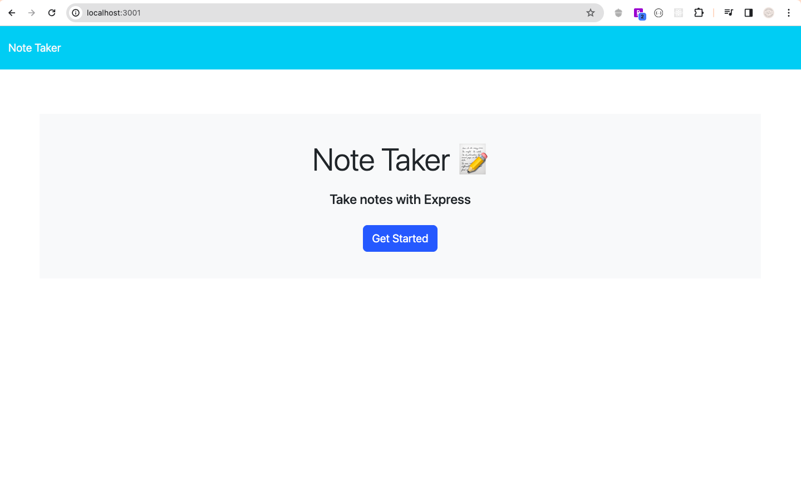
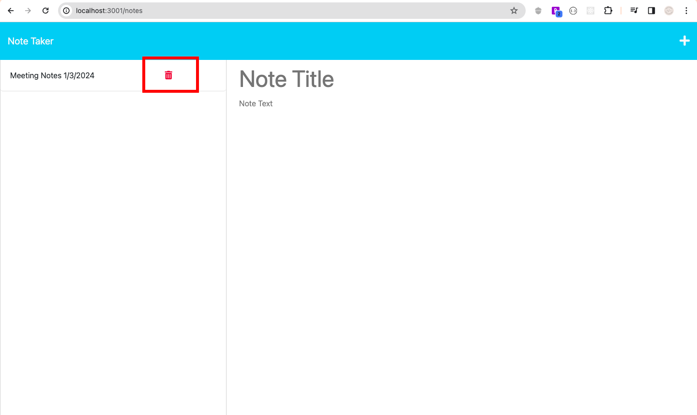

# Note Taker Application (BackEnd)

## Description

The Note Taker API allows the user to write and save notes. Explore the app by visiting this link: https://note-taker-api-17e96f4e9ed9.herokuapp.com/




## Table of Contents 

  - [Installation](#installation)
  - [Usage](#usage)
  - [License](#license)
  - [Contributions](#contributions)
  - [Test](#test)


## Installation

The application required Node.js. Install the packages by using the following command into your integrated terminal:

```bash
npm install
```

## Usage

This Note Taker API had it's front-end fully created, but the back-end was not funtional. Using CRUD, I re-engineered the starter code to use Express.js back-end and that connected the application to it's database, allowing users to create, save and retrieve note data as they use the app. 


When the application is open, the user will be greated by the landing page where they can get started by clicking the 'Get Started' Button. 


On notes page, the user will be able to create a new note and save it. 


Saved notes can be seen on the left-side column where the user can choose to view pasts the notes again.


The user also has the option to delete previoously saved notes by clicking the trash icon. 



## License

[](https://opensource.org/licenses/MIT)


## Contributions

N/A

## Test

The application was tested in the VS Code integrated terminal, invoked by using the following command:

```bash
npm start
```

